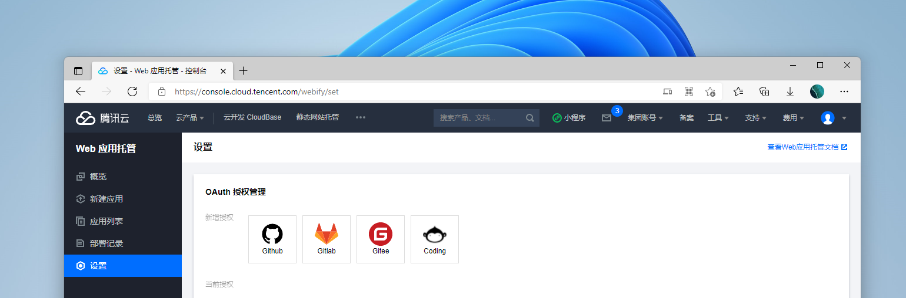
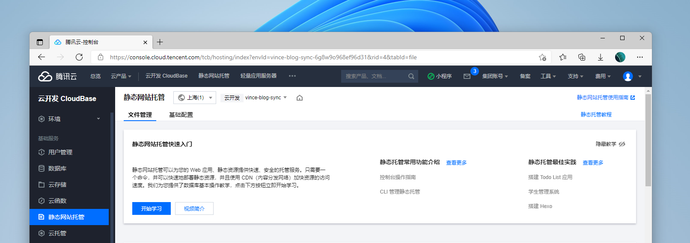
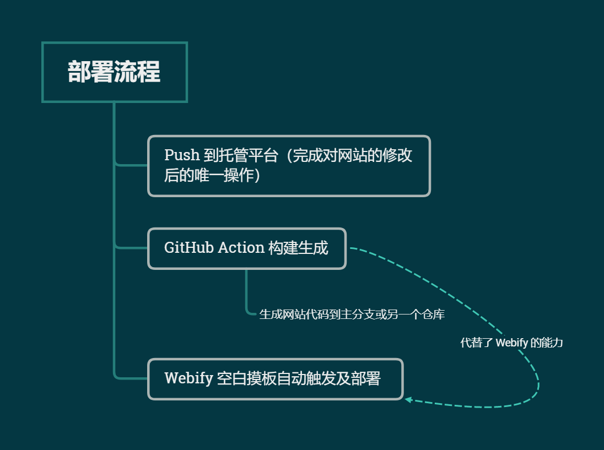

## 前言

### 与云开发的渊源

其实我算是云开发比较早的用户，最早开始使用云开发是在去年，参加了云开发的静态网站托管赞助计划。这一切都要从个人博客的部署说起，我相信 GitHub Page 是很多人对静态托管的启蒙，有一个先吃饱再吃好的循序渐进的步骤，访问速度在后期也成为选择部署的主要考虑因素，通过赞助计划开始接触到云开发的各项服务。

最早是通过 cloudbase-action 这个插件将博客推送到云开发的静态托管，但是由于 GitHub Actions 的 Runner 的局限性，部署过程中网络环境有很大的局限性。这也是第一个版本，第二个版本借助了  CloudBase Framework 的赋能。在这里我也有感觉，webify 的灵感也有一些来自这里。

### Webify

Serverless 模式最近一直很火热，我个人对云开发的理解就是做中国的 Vercel，在 Vercel 和 Cloudflare Pages 面前，还是很开心国内也有做一款类似的产品。在我看来，Webify 提供的是一个一站式的解决方法，现在这种方式下，每次 Push 后剩下的一套流程都不需要我动手了（例如静态页面生成、部署和 CDN 配置等），这应该是个人博客及网站比较理想的一个方法。

## 体验



Webify 目前支持了主流的托管平台和绝大多数的网站框架模板，使用过程就不再累赘，OAuth 授权之后，导入仓库即可，对已支持的模板还可以进行自动识别，整个操作来说算是十分顺畅。



部署完成后会发现在静态托管中会多一个环境，这就是 Webify 部署过来静态资源。其实我简单的理解把它当作 **静态托管 + CloudBase Framework** 的结合。这样也解决了之前说到的一个痛点，GitHub Actions 的 Runner 因为网络环境带来的问题。之前需要使用 GitHub Actions 这样的 CI/CD 能力来构建部署网站，**Webify 就是赋予了这样一种能力。**

## Hugo 的部署



目前的 Webify 还没有支持 hugo 的摸板，交流群里[@王伟嘉](https://github.com/starkwang)也给出了`将 hugo 的可执行二进制文件（linux64）放到项目里，在构建的时候调用运行`这样的方法。Webify 支持自定义构建配置，这样的方法确实非常好。但我用了另一种思路，借助 GitHub Actions 的能力，构建生成到另一个仓库或主分支，再由  Webify 的空模板配置去部署。这样的方法相对而言有些“听君一席话，如听一席话的感觉”，但我觉得这也是一个比较简单的解决方案。

```yaml
name: Deploy to Sync-repo

on:
  push:
    branches:
      - main

jobs:
  deploy:
    runs-on: ubuntu-latest
    steps:
      - uses: actions/checkout@v2.3.2
        with:
          submodules: true  # Fetch Hugo themes (true OR recursive)
          fetch-depth: 0    # Fetch all history for .GitInfo and .Lastmod

      - name: Setup Hugo
        uses: peaceiris/actions-hugo@v2
        with:
          hugo-version: '0.79.1'
          extended: true

      - name: Build
        run: hugo --minify
      
      - name: Deploy
        uses: peaceiris/actions-gh-pages@v3
        with:
          deploy_key: ${{ secrets.ACTIONS_DEPLOY_KEY }}
          external_repository: vinceying/vince-blog-sync
          publish_branch: main
          publish_dir: ./public
```

我相信后期 Webify 的模板是越来越多的，它也支持自定义构建配置。**但我认为，这或许也是一个思路，对于 Webify 来说，模板是许许多多的，所以开放自定义构建配置，当对于入门或追求方便的使用来说，面对各种各样的网站架构和功能，GitHub Actions 上的模板及资源，或许可以成为我们构建的好帮手。**
