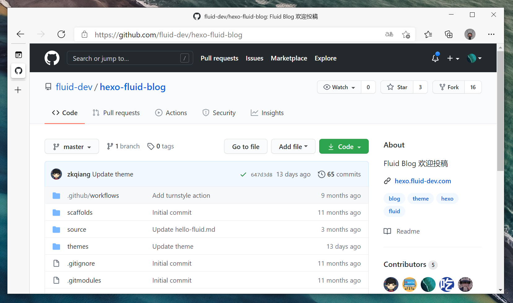
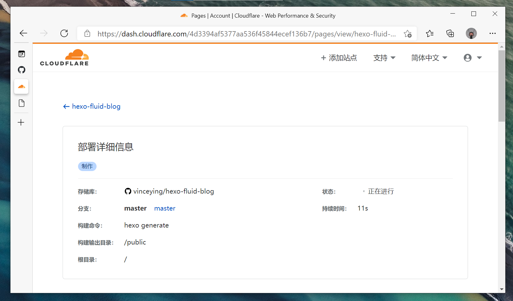
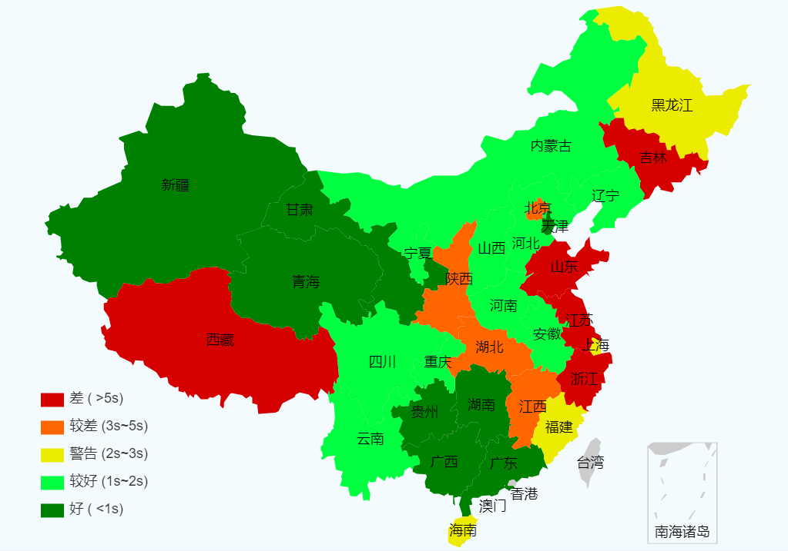
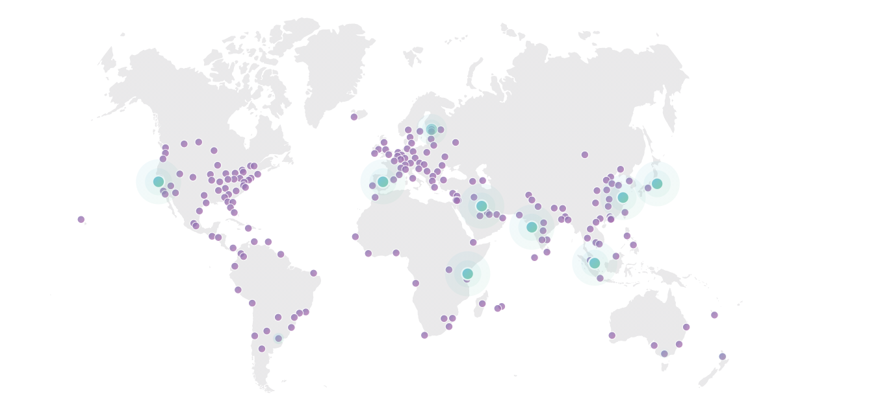

## 概述

从看到相关产品新闻后，还是非常期待这个产品的。我在去年12月订阅了 Cloudflare Pages 的相关消息，一直等到今天凌晨在接到了可以开始测试使用的邮件。相比与 Vercel 和 Netlify 等同类产品来说，Cloudflare Pages 的最多优势在于节点。在此之前，我相信很多就接触或者使用过 Cloudflare 的全球加速服务了。值得一提的是，相对来说 Cloudflare 的大陆节点确实还不少。

总结了一下，总共有以下几点特性，应该也算是该有的基本功能。团队协作，可以邀请加入 Cloudflare 帐户，以协作处理所有项目。快速构建，我们最常用到的 Git 集成，这也与版本管理相关联。目前已经支持大部分的框架和工具，具体可以 [相关文档](https://developers.cloudflare.com/pages/platform/build-configuration)。最重要的是，提供的免费服务也足够我们的使用。

- 团队协作
- 快速构建
- 版本管理
- 免费高速

## 试用和对比

 

我们以克隆 Hexo Theme Fluid 官方博客来进行对比和试用。首先 Fork 仓库，官方博客使用 dogedoge 提供的图床，本来是想再做一个分支，做图片本地化及评论和统计的同步，但是太懒了。这里我们就不作修改的直接对比了，构建过程非常简单，hexo 和 hugo 这类的相关软件太普遍了，都有模板。

 

随便找了一个网站测速工具，从上图可以看出，Cloudflare Pages 在大陆下的访问速度还是比较快的，当然，实际情况还是可以自己对比的，**另外，可能影响到的因素还有评论服务和访问统计。**

- 官网站：https://hexo.fluid-dev.com/
- 克隆站：https://hexo-fluid-blog.pages.dev/

```bash
- name: Upload to OSS
    env:
    OSS_AccessKeyID: ${{ secrets.OSS_AccessKeyID }}
    OSS_AccessKeySecret: ${{ secrets.OSS_AccessKeySecret }}
    run: |
        wget -q http://gosspublic.alicdn.com/ossutil/1.6.10/ossutil64
        chmod +x ./ossutil64
        ./ossutil64 config -e oss-ap-southeast-1.aliyuncs.com -i $OSS_AccessKeyID -k $OSS_AccessKeySecret -L CH
        ./ossutil64 cp -r -f oss://fluid-dev/docs ./public/
        ./ossutil64 rm -r -f oss://fluid-dev/
        ./ossutil64 cp -r -f ./public oss://fluid-dev/
```

另外，从 hexo-fluid-theme 仓库的 Github Actions 代码可以看出，官方博客部署的阿里云 OSS 上，Ping 一下，主要有香港和美国两个节点。

## 节点



截至目前，从 [Cloudflare System Status](https://www.cloudflarestatus.com/) 来看，在中国总共有23个节点，其中包含21个大陆节点，香港和台北各一个。在 Cloudflare 的全球节点支持下，相当于我们部署了全球 CDN，对于一个免费的产品来说，这完全足够我们使用了。

## 利用 Cloudflare Pages 分发静态资源

在此之前，我们通常使用 jsdelivr 来分发静态资源，选择静态文件仓库，无构建命令即可。

### 加载对比

以一张图片为例，可以复制到浏览器打开，体验相关速度。在我的环境下，Cloudflare 是不如 JSdelivr 的加载。实际效果请自行对比。

对比组一，图片大小：1.44 MB。

- [JSdelivr](https://cdn.jsdelivr.net/gh/vinceying/blog-file@master/photo/1593359677879-a4bb92f829d1.jpg)  
- [Cloudflare](https://blog-file.pages.dev/photo/1593359677879-a4bb92f829d1.jpg)

对比组二，图片大小：336 KB。

- [JSdelivr](https://cdn.jsdelivr.net/gh/vinceying/blog-file@master/photo/bg.jpg)  
- [Cloudflare](https://blog-file.pages.dev/photo/bg.jpg)

## 写在最后

**Cloudflare Pages 速度不一定优于其它平台，取决于地区和网络环境等等诸多因素，具体效果请自行测试。** Cloudflare Pages 做镜像站也是一个不错的选择，玩法多多，不妨尝试一下。


