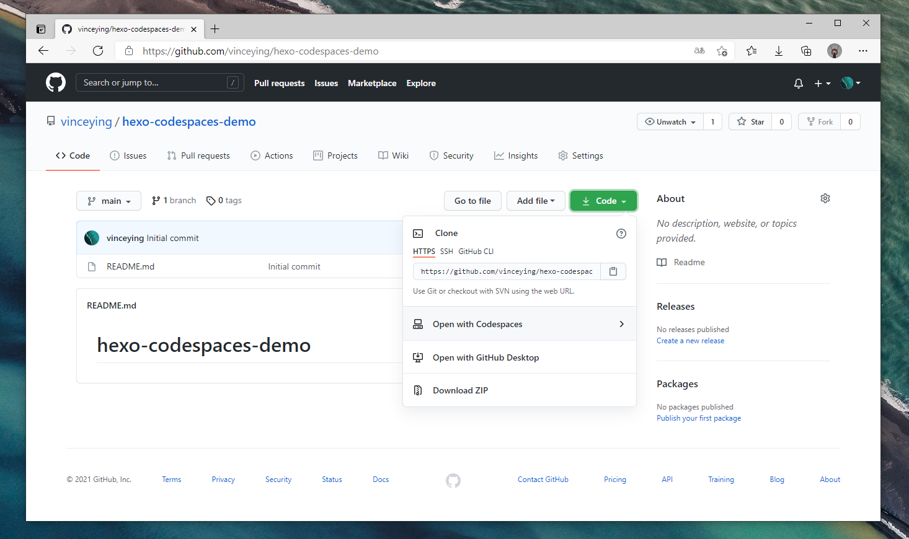
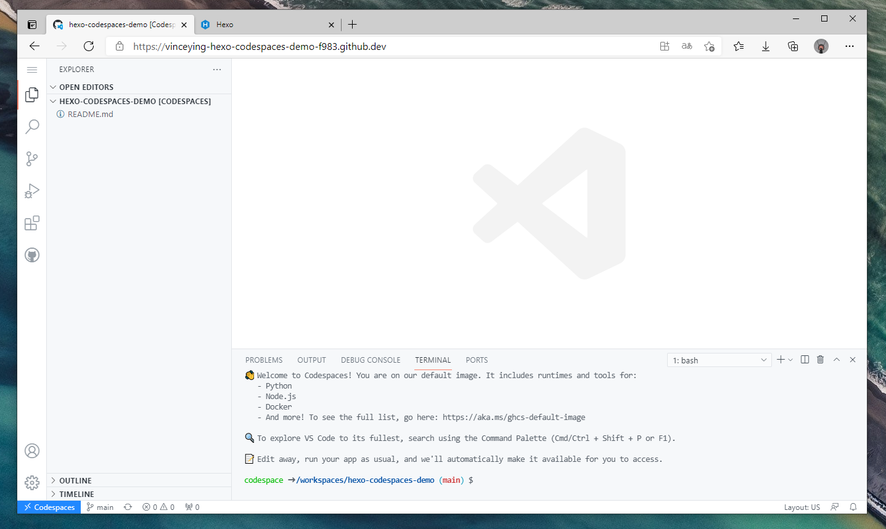
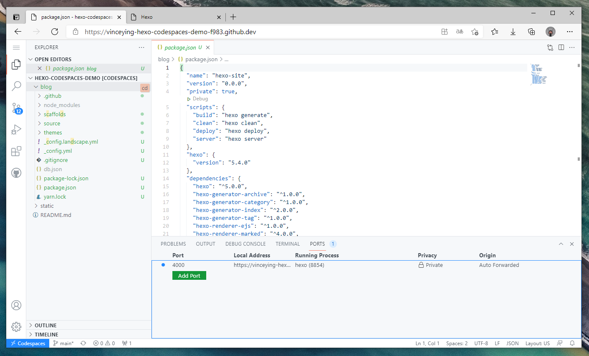
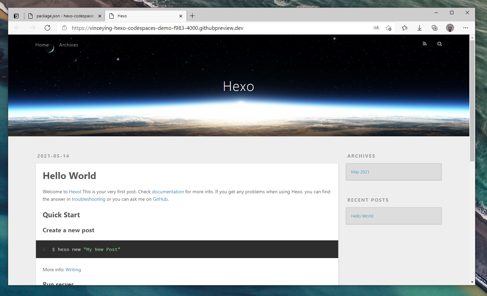

## 前言

多数情况下，我们会选择将 Hexo 安装在本地，其中最大的痛点就是不能多设备同步和环境固定。之后，在 GitHub Actions 推出以后，我们可以将 Hexo 的 Source 文件保存，通过 CI 来部署我们的博客，这样的好处就是跨设备同步非常方便，但是预览上会遇到一些问题。现在，GitHub 的 Codespaces 推出后，Hexo 的纯前端编辑部署完全可以实现了。本篇介绍如何使用 Codespaces 搭建 Hexo 博客及几种部署方法。Codespces 还支持**自动设置依赖关系、SSH 密钥。**

## 安装

### 仓库及环境

 

创建一个新的仓库，由于我将静态资源也存放到这个仓库（之后会提及)，所以**推荐使用公开库**，如果需要使用私有库，需要将静态资源分离，放在一个公开库，创建之后打开 Codespaces。


接下来即可安装 Hexo，Codespaces 内置了 Node.js 和 Git，无需再安装相关应用程序。安装 Heox [文档](https://hexo.io/zh-cn/docs/)，的相关内容，我们很快就可以完成安装。

```shell
npm install -g hexo-cli # 全局安装 Hexo。
hexo init blog # <folder> 这里以 blog 为例。
cd blog
npm install
```

以上我们已经完成了 Hexo 的安装和建站，Hexo 的 Source 文件位于 `/workspaces/hexo-codespaces-demo/blog` 下。依据个人需求对配置项进行调整后便可以开始预览了。

 

```shell
hexo clean
hexo s
```

`hexo s` 后便可以通过 Codespaces 提供的网站来预览博客了。Codespaces 的一大亮点就是**可以将 Local Address 映射到公网**，这样我们就可以通过这个功能来预览主题和修改了。

### 主题安装

这里以 [hexo-theme-fluid](https://github.com/fluid-dev/hexo-theme-fluid) 为例来安装主题，使用 git clone 来克隆主题文件。之后根据自己的需求来调整配置项，关于 hexo 和主题的配置，这里就不再累赘了。


```shell
cd themes # 位于 /workspaces/hexo-codespaces-demo/blog 下。
git clone https://github.com/fluid-dev/hexo-theme-fluid.git
```

## 部署

这里主要写了 hexo deploy 和一些 JAMStack 的平台的部署，关于部署到服务器和 OSS 等平台就不多累赘了，可以通过 GitHub Action 来实现。

### 使用 hexo deploy 来部署

Hexo 提供了快速方便的一键部署功能，让您只需一条命令就能将网站部署到仓库上。这个部署多用于在 GitHub 等代码托管平台上，用于使用相关的 Page 服务。**注意，每次做出改动都需要手动部署生效。**

安装 hexo-deployer-git 插件。

```shell
npm install hexo-deployer-git --save
```

在 `_config.yml` 中修改 deploy 配置项。

```yaml
deploy:
  type: git
  repository: <repository url> # demo:git@github.com:vinceying/hexo-codespaces-demo.git
  branch: [branch]
  message: [message]
```

```shell
hexo clean # hexo 三连
hexo g
hexo d
```

### 使用 Vercel 或 Netlify 等 JAMStack 平台部署

使用此类平台部署选择对应仓库即可，但是由于 Hexo 源文件没有在根目录，注意填写 `ROOT DIRECTORY` 项，比如这里填写 blog。

## 写在最后 

使用 Codespace 的最大有点在于多设备使用、预览和方便快捷（自动设置依赖关系、SSH 密钥等）。使用 Codespace 可以跨平台，且没有本地依赖的相关。

### 关于 Static 文件夹

之前也有提及，创建这个文件夹主要是使用 [JSdelivr](https://www.jsdelivr.com/github) 来对静态资源进行加速，放在同一个仓库完全是为了方便管理。

### Fork 使用

你可以通过查看 [README](https://github.com/vinceying/hexo-codespaces-demo#readme) 来了解如何快捷使用。


