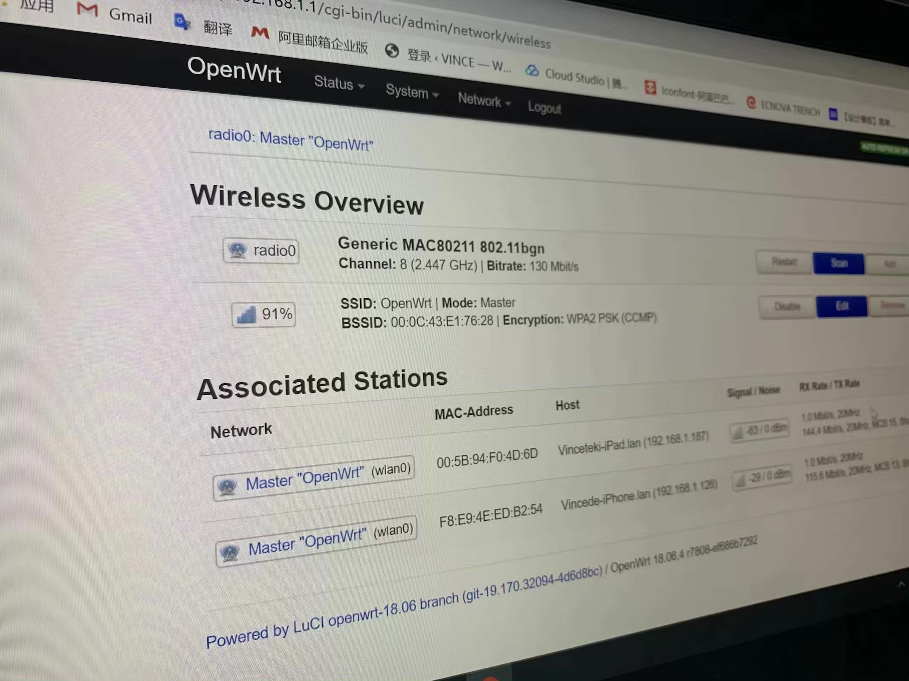
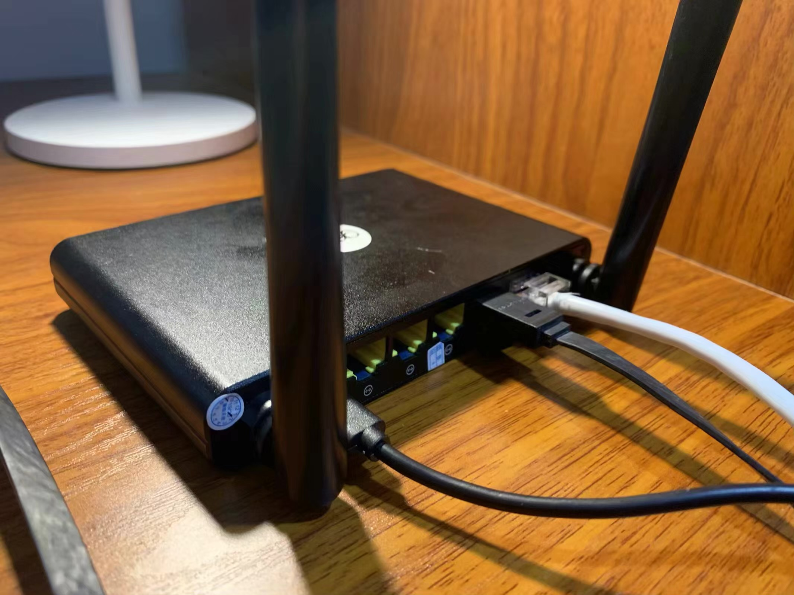

## 无言以对的校园网政策

众所周知，某些学校的校园网完全就是一个商业项目，对使用有十分大的限制。比如我所在的学校，只运行一台设备在线，WLAN 和 LAN 需要选择一个，不能混用账号。然而，经过实测校园网分配给每个用户的物理带宽早就超过了百兆，足以够一个小型家庭使用，何况是一个宿舍。学校的这种做法无非是恰X钱。入学开始我就开始了对校园网的探索，起初的想法是路由器模拟设备镜像认证，因为有前人栽树的缘故，一切都进行的比较顺利。

## 对认证方式的分析

### 初探

初次登录，未进行认证的设备会重定向到登录界面，通过查看源代码，这不就是 Ruijie WEB Portal 接入认证。我觉得先到 Github 找一下例子，梳理一些思路。当我在 Github 搜索 Ruijie Portal 时，一个叫 [RuijiePortalLoginTool](https://github.com/callmeliwen/RuijiePortalLoginTool) 的项目让我发现，一切似乎都变的简单起来了。

### 实现原理


构造的关键便是这步，去年的时候我一直以为 Ruijie 会将主程序升级，然而我发现，像我校这种**，会一直为认证服务器使用出厂版本。

```Python
#Structure loginURL
loginURL=`echo $loginPageURL | awk -F \? '{print $1}'`
loginURL="${loginURL/index.jsp/InterFace.do?method=login}"

#Structure quertString
queryString=`echo $loginPageURL | awk -F \? '{print $2}'`
queryString="${queryString//&/%2526}"
queryString="${queryString//=/%253D}"

#Send Ruijie eportal auth request and output result
if [ -n "$loginURL" ]; then
  authResult=`curl -s -A "Mozilla/5.0 (Windows NT 10.0; Win64; x64) AppleWebKit/537.36 (KHTML, like Gecko) Chrome/61.0.3163.91 Safari/537.36" -e "$loginPageURL" -b "EPORTAL_COOKIE_USERNAME=; EPORTAL_COOKIE_PASSWORD=; EPORTAL_COOKIE_SERVER=; EPORTAL_COOKIE_SERVER_NAME=; EPORTAL_AUTO_LAND=; EPORTAL_USER_GROUP=%E5%AD%A6%E7%94%9F%E5%8C%85%E6%9C%88; EPORTAL_COOKIE_OPERATORPWD=;" -d "userId=$2&password=$3&service=$interface&queryString=$queryString&operatorPwd=&operatorUserId=&validcode=&passwordEncrypt=false" -H "Accept: text/html,application/xhtml+xml,application/xml;q=0.9,image/webp,image/apng,*/*;q=0.8" -H "Content-Type: application/x-www-form-urlencoded; charset=UTF-8" "$loginURL"`
  echo $authResult
fi
```

## 使用

### 首次使用

 

去年刚入学时，出于谨慎，我在二手市场花了20块买了个二手极路由，用于网络的测试。一切都非常顺利，刷入 OpenWrt 后，开启路由器的 SSH，然后上传脚本，运行即可。我原本以为会花了我很多时间去解决这个问题，没想到还是非常快的。但是路由器性能的原因，加上我有很多设备以及宿舍公用，路由器经常满载和死机，需要重启来解决。文档中也有提及，使用 Cron 来定时运行脚本，但是由于使用习惯，我更加倾向于断网后路由器断电。

```bash
sh /filepath/ruijie.sh usename password
```

### 使用快捷指令运行脚本

在不使用 Cron 定时任务的情况下，我需要每次都使用 SSH 连接路由器然后运行脚本。得益于快捷指令 APP，快捷指令支持 SSH 连接，这一切又变的简单起来了。


### 新路由器，Redmi AC2100

前面也有提及，因为之前只是想做一个实验性的操作，选择了价格实惠，翻车也可接受的20元二手极路由，但是由于宿舍设备增加，在校半年，疫情半年，今年是时候换新了。逛了一下恩山，最后发现 AC2100 还是真香的。

不过 AC2100 不带 USB 端口，这旧以为着刷机没有那么简单了。在没有漏洞的情况下，拆机刷机是唯一选择。恩山老哥还是非常稳的，不拆机教程还是有的。比起以前刷个 Breed，然后刷固件难度确实增加了很多。简单的步骤就是通过后门开启 telnet，获取 root 权限，刷写固件，这里就不累赘了，恩山有非常详细的[教程](https://www.right.com.cn/forum/thread-4027477-1-1.html)。